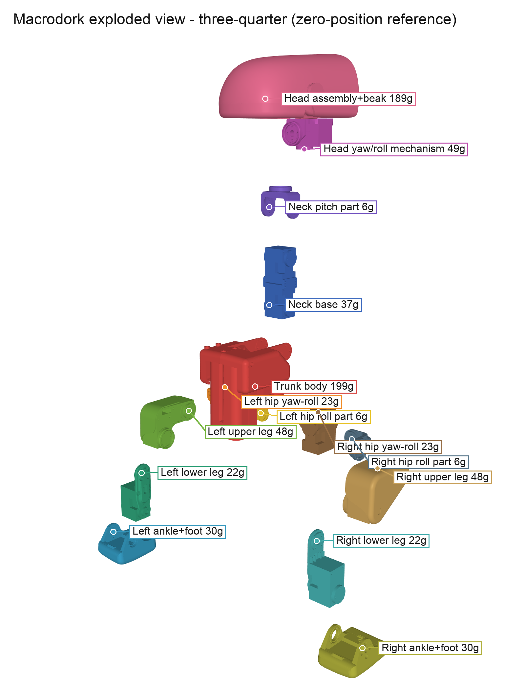
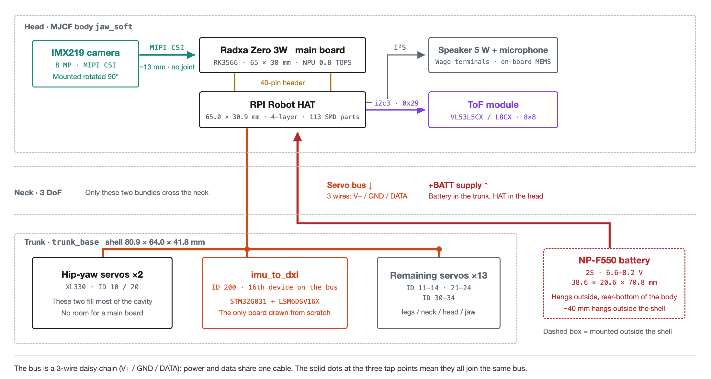

# Macrodork

> An open, buildable bipedal robot duck. Assembly drawings, exploded views, CAD-importable
> assemblies, a printable parts list, a bill of materials and a complete electronics
> teardown, all recovered from publicly released simulation files and source code.

Macrodork is a 25 cm, 737 g bipedal robot duck driven by 15 Dynamixel XL330 servos
(14 under policy control) that learns to walk with reinforcement learning. Its geometry,
kinematics and electronics follow an upstream commercial robot whose simulation model and
runtime are open source. What this repository adds is everything needed to actually build one,
which upstream never published: assembly relationships, part quantities, the fastener system,
a bill of materials, the reconstructed IMU-board protocol and sourcing lists.

> **Provenance.** Which upstream material this is derived from, what is and is not published
> upstream, and the licence terms that follow: [Upstream Provenance](docs/upstream/provenance.md)
> and [NOTICE.md](NOTICE.md). Macrodork is an independent project, not affiliated with or
> endorsed by the upstream vendor.

Two public artifacts turn out to be enough:

1. **The upstream simulation model ships the full MJCF and 47 STL meshes.** The MJCF contains the
   complete kinematic tree - which part mounts to which, relative positions accurate to
   0.1 mm, joint axes, travel limits, masses and inertia tensors.
2. **The upstream runtime is open source, and a runtime that drives real hardware must
   hard-code device paths, I²C addresses, register offsets, baud rates and protocols.**
   The code *is* the datasheet.

**That information is enough to recover the assembly.** This repository is what falls out of reading both.

> ✅ **Independently verified.** On 2026-08-31, [@tspy](https://x.com/tspy/status/2094249218735300630)
> published a hardware teardown on X (169 likes) that matches this repository's
> conclusions exactly - including the critical one: **the main board is a Radxa Zero 3W**.
> Two independent paths, one answer. See [Community Intelligence](docs/community-intelligence.md).

---

## 🔨 Build Progress

**Someone is actually building this.** The head shell, trunk shell, leg structure and feet
are printed, and **the M2 screws go into the leg parts** - the conclusion in
[Fastener Reconstruction](docs/fastener-reconstruction.md) holds on physical hardware.


The rest of this repository is **analysis on paper**, recovered from the public MJCF and
source. The [Build Log](BUILD-LOG.md) records the hands-on side - print settings,
assembly problems, and whether the derived numbers hold up on real parts.

> This repository states repeatedly that simulation STLs are not manufacturing files.
> **The build log is the test of that claim.** The result gets recorded either way.

**→ [Build Log](BUILD-LOG.md)**

---

## Exploded Assembly View



Seven drawings under `assembly-drawings/`:

| File | Contents |
|---|---|
| `01_front` `02_side` `03_back` `04_three_quarter` | Front / side / rear / isometric, assembled, natural colors |
| **`05_exploded_side`** | 15 parts exploded along the kinematic chain, labeled with names and masses |
| **`06_exploded_three_quarter`** | Isometric - shows the left/right leg mirroring clearly |
| `07_color_coded_assembled` | Assembled state in the same color coding as the exploded views, for cross-reference |

## Assembly Structure

```
Trunk 199 g
├─ L hip yaw→roll 23 g → L hip roll 6 g → L thigh 48 g → L shin 22 g → L ankle+foot 30 g
├─ Neck base 37 g → Neck pitch 6 g → Head yaw/roll 49 g → Head assembly + beak 189 g
└─ R hip yaw→roll 23 g → R hip roll 6 g → R thigh 48 g → R shin 22 g → R ankle+foot 30 g

Total 737.2 g   Envelope 144 × 141 × 264 mm
```

The trunk and the head weigh almost the same (199 g vs 189 g) - **the head is a quarter of
the whole robot and the center of mass sits high**, which explains why its walking policy
is hard to train.

## Joint Parameters

Five DoF per leg, four for neck and head - **14 under policy control**.
The robot actually carries **15 Dynamixel XL330**: the 15th drives the beak / lower jaw through a
passive linkage and never enters the action space.

| Joint | Travel |
|---|---|
| `hip_yaw` | −25° … +30° |
| `hip_roll` | ±22° |
| `hip_pitch` / `knee` / `ankle` / `head_pitch` | ±90° |
| `neck_pitch` | −90° … +60° |
| `head_yaw` | ±170° |
| `head_roll` | ±25° |

## 📋 Bill of Materials

**What to buy and how many** - [`BOM.md`](BOM.md)

15 servos, 14 bearings, ~325 fasteners, 2 boards to fabricate. Quantities are counted from geom
references in the upstream MJCF (38 mesh types / 75 instances), not estimated. Includes a per-board
parts list with LCSC numbers.

> ⚠️ Two corrections in there that stop you buying the wrong thing: **the battery is an NP-F550,
> not an F970**, and **the XL330 is run over-voltage**.

## 3D-Printable Parts

Every individual STL, split into print-these and buy-these, with Macrodork part names -
[`print/`](print/)

| Directory | Count |
|---|---|
| `print/printed-parts/` | **30 types / 41 pieces** of structural parts |
| `print/standard-parts-not-printed/` | **8** bought-part models (for fit checking) |
| `print/variant-roller-skate/` | 5 types / 15 pieces for the roller-skate variant |

The STL files themselves are not stored in this repository. `scripts/build_print_tree.py`
generates the tree from the upstream mesh release at a pinned commit, renaming each mesh to its
Macrodork name (see "Reproducing This" below). The name mapping, quantity table and printing
notes are in [`print/README.md`](print/README.md); sourcing is in the
[Mechanical Sourcing List](docs/mechanical-sourcing-list.md).

## CAD Assemblies

`cad/` holds STL files **with world transforms already applied** - import them and the
robot is assembled. (The 47 upstream STLs are each in their own part coordinate frame;
importing those directly piles every part at the origin.)

- `00_macrodork_full_assembly.stl` - whole robot, single file, 796,792 triangles
- `01` … `15` - the 15 rigid bodies, filenames are part names
- `parts_manifest.json` - which upstream source meshes make up each body

Units are **millimeters**. Opens in FreeCAD, Fusion 360, SolidWorks, Blender, or any slicer.
No CAD installed? `tools/stl_viewer.html` is a zero-install WebGL viewer - open it in a
browser and drop an STL in.

---

## Electronics, Reverse-Engineered from the Runtime

<div align="center">
  
  <br>
  <sub><b>Physical layout of the five modules.</b> Dashed grey = physical region, solid = module,
  dashed red = mounted <b>outside</b> the shell.<br>
  <b>Orange</b> is the servo bus (top-down), <b>red</b> is battery power (bottom-up).<br>
  The one thing people get wrong: <b>the compute board, the HAT and the camera are all in the head</b> -
  the camera sits ~13 mm from the board centre with no joint between them,<br>
  so the MIPI ribbon never crosses the neck. What does cross it is the servo bus and the power line.<br>
  <a href="docs/hardware-primer.md">Full diagram set with commentary →</a> · <a href="assets/hw/macrodork-hardware-diagrams.pdf">Download PDF (7 diagrams, A3)</a></sub>
</div>


**One 1 Mbps TTL serial bus does everything.**

```
                Radxa Zero 3W (RK3566) · Armbian
                  ├── UART2  1 Mbps TTL half-duplex ── 15× XL330 + imu_to_dxl (ID 200)
                  ├── I2C3   400 kHz (pins 3/5) ────── AIC3104@0x18 · ToF@0x29 · BMI088 (unused)
                  ├── I2S3   12.288 MHz ────────────── audio
                  ├── MIPI CSI ─────────────────────── IMX219 (I2C@0x10, rotated 90°)
                  ├── Bluetooth ────────────────────── gamepad / phone app
                  ├── Wi-Fi ────────────────────────── WebRTC
                  └── USB-C ────────────────────────── power + maskrom
```

| | |
|---|---|
| **Main board** | **Radxa Zero 3W** - an off-the-shelf module, *not* a custom carrier |
| SoC | RK3566, quad Cortex-A55, Mali-G52, 0.8 TOPS NPU. Officially 1 GB RAM / 32 GB eMMC; for a replica we recommend 2G/16G, see [Electronics Sourcing List](docs/electronics-sourcing-list.md) |
| **Servo bus** | **Single-wire half-duplex TTL** - *not* RS-232, *not* RS-485. Dynamixel Protocol V2 @ 1 Mbps on `/dev/ttyS2` |
| **Custom board 1** | **`imu_to_dxl` v2** - an LSM6DSV16X that speaks Dynamixel: bus ID 200, register 124, a 12-byte block read in the *same* `sync_read` as the servos |
| **Custom board 2** | **RPI Robot HAT** - TLV320AIC3104 @ 0x18, a dormant BMI088, a Stemma header for the ToF. **Published upstream** ([`elec_RPI_Robot_HAT`](https://github.com/pollen-robotics/elec_RPI_Robot_HAT)) |
| Battery | Sony NP-F550, 2S Li-ion. **No fuel gauge, no ADC** - pack voltage is read from what the servos report as their own supply |
| Sensors | LSM6DSV16X IMU · VL53L5CX/L8CX 8×8 ToF · IMX219 (Pi Camera v2) |

The `imu_to_dxl` design is the elegant part: **the IMU is not on I²C**. It presents itself as a
Dynamixel slave, so orientation arrives in the same bus transaction as the joint states -
no second bus, no host-side sensor fusion (the LSM6DSV16X's on-chip SFLP block emits a game
rotation quaternion and estimates its own gyro bias).

**Full detail:** [Hardware Teardown](docs/hardware-teardown.md) · [Hardware Spec Sheet](docs/hardware-spec-sheet.md)

---

## Feasibility: Can You Actually Build One?

**The whole robot is reproducible; the sticking point is cost, not technology.** Current status:

| | Status |
|---|---|
| Part geometry | ✅ 47 STLs |
| Assembly relationships | ✅ 0.1 mm accurate, drawings produced |
| Joint axes / travel | ✅ all 14 |
| Mass / inertia | ✅ all 15 bodies |
| Servo model | ✅ Dynamixel XL330 × 15 → [docs/actuator-selection.md](docs/actuator-selection.md) |
| Bearings | ✅ Ø22×16×4 and Ø15×10×3 |
| **HAT board** | ✅ **Published upstream** - KiCad + Gerbers + BOM, order directly → [`elec_RPI_Robot_HAT`](https://github.com/pollen-robotics/elec_RPI_Robot_HAT) |
| **`imu_to_dxl` board** | ⚠️ Not published; must be redrawn. Protocol and register layout fully recovered → [docs/hardware-teardown.md](docs/hardware-teardown.md) |
| Main board | ✅ **Radxa Zero 3W, off the shelf** (previously misjudged as a custom carrier) |
| **Fastener list** | ✅ Reverse-engineered from STL hole features → [docs/fastener-reconstruction.md](docs/fastener-reconstruction.md) |
| Battery / sensors | ✅ **NP-F550** 2S, IMX219, VL53L8CX, LSM6DSV16X |
| **Cable routing** | ❌ Nothing published |
| **Control software** | ✅ Use the same Radxa Zero 3W and the upstream Rust runtime runs as-is (Apache-2.0); porting is only needed if you change the main board |
| **Upstream ONNX policies** | ✅ Usable as-is (9 of them) if the hardware stays identical; retraining is only needed if you change the body or electronics |

⚠️ **Simulation STLs are not manufacturing files.** Simulation only needs outer shape and
inertia - it guarantees nothing about fit tolerances, threads, heat-set insert bosses or
cable clearance. Printing these directly will most likely not assemble; you will need to add
the engineering details yourself.

💰 **Building one probably costs more than buying the upstream robot - but how much more depends
entirely on your channel.** Fifteen XL330s run about **$359** at ROBOTIS international, **$412** at
ROBOTIS US, and **€603–629** in Europe inc-VAT - anywhere from slightly under the upstream retail
price to well above it. Add the compute module, battery, two boards to fabricate and filament, and
it is certainly more. Full costing: [BOM.md](BOM.md).

## The Realistic Path

Skip 100% replication (the `imu_to_dxl` board and editable mechanical CAD are not published) and go
**"copy the mechanics, build your own electronics"**:

| | Approach |
|---|---|
| Mechanics | Use the STLs and drawings here - geometry copies exactly |
| Servos | XL330 × 15, off the shelf |
| Main board | **Radxa Zero 3W**, off-the-shelf module, same as the original |
| IMU board | Roll your own `imu_to_dxl`: LSM6DSV16X + a small MCU + half-duplex transceiver. The protocol is fully documented here |
| HAT | **Order the upstream Gerbers** (4-layer). If you don't need audio recording you can skip it entirely, **but the half-duplex direction circuit then needs its own adapter board** - see [Electronics Sourcing List](docs/electronics-sourcing-list.md) (section "The Two PCBs") |
| Software | Same main board → the upstream Rust runtime runs unmodified (Apache-2.0) |
| Policies | The nine upstream ONNX policies work; retrain with the [upstream RL environment](https://github.com/pollen-robotics/microduck_rl) if you change hardware |

**The conclusion has been revised** from "the mechanics are copyable, the electronics are a wall"
to **"the whole robot is reproducible"** - the main board is an off-the-shelf module, and the custom
boards' function and protocol have been fully recovered from source.
See [docs/hardware-teardown.md](docs/hardware-teardown.md).

---

## Three Pitfalls You Will Hit

1. **Armbian runs a login console on UART2.** `serial-getty@ttyS2` holds the port -
   `systemctl mask` it. Upstream found this with `fuser -v /dev/ttyS2`.
2. **i2c3 collides with the FUSB302.** Using the hardware I²C on header pins 3/5 costs you
   **USB-C PD negotiation** (plain 5 V charging still works).
3. **The NPU ships disabled** in Armbian - flash the overlay and reboot to run RKNN models.

---

## Documentation

| Document | Contents |
|---|---|
| [Fastener Reconstruction](docs/fastener-reconstruction.md) | Hole-feature scan across 47 STLs → M2 screw system and purchase quantities |
| [Actuator Selection](docs/actuator-selection.md) | XL330 parameters, BAM M6 config, five calibrated PD sets, backlash modeling; **why closed-loop steppers do not work here, what swapping to an STS3215 actually costs** (737 g vs 2107 g, measured), and a **cross-comparison of same-class servos** including a deep assessment of the Unitree S288 |
| [**Hardware Primer**](docs/hardware-primer.md) | **Board by board** - what each of the five modules does, how signals flow within one tick, what changes on the Feetech route, and a closing section on **five checks to run before you replicate** |
| [**Hardware Spec Sheet**](docs/hardware-spec-sheet.md) | **One-page reference** - block diagram, part numbers, bus parameters, build list, pitfalls |
| [Hardware Teardown](docs/hardware-teardown.md) | Full derivation with evidence citations |
| [**Electronics Sourcing List**](docs/electronics-sourcing-list.md) | **Taobao links with verified availability** - main board / camera / ToF / power / both PCBs / cabling and the debug adapter, with selection reasoning and pitfalls (2026-09-04 snapshot) |
| [**Mechanical Sourcing List**](docs/mechanical-sourcing-list.md) | **Taobao links** - bearings / M2 fasteners / heat-set inserts and the insertion tip / thread locker / filament |
| [Community Intelligence](docs/community-intelligence.md) | X / GitHub signals, independent verification, noise and scam warnings |
| [Upstream Provenance](docs/upstream/provenance.md) | What upstream published, what it did not, baseline commits |
| [Upstream Ecosystem](docs/upstream/ecosystem.md) | Upstream repos, simulators, policies, datasets and community projects, annotated |
| [Progress](PROGRESS.md) | Status, decisions, open work |

Headline result: **the whole robot is an M2 screw system** (Ø2.2 through-holes ×77 + Ø4.4 counterbores ×28 + Ø1.6 tap-drill holes ×20),
about 146 through-holes across the structural parts; bearings Ø22×16×4 and Ø15×10×3.

---

## Reproducing This

```bash
# 1. Fetch upstream (nothing from upstream is stored in this repository)
bash scripts/fetch_upstream.sh

# 2. Build the printable-parts tree (pinned upstream commit, Macrodork part names)
python scripts/build_print_tree.py

# 3. Regenerate the drawings
python scripts/render_assembly.py upstream/microduck_rl assembly-drawings

# 4. Re-export the CAD assemblies
python scripts/export_assembly_stl.py upstream/microduck_rl cad

# 5. Re-scan hole features
python scripts/analyze_holes.py upstream/microduck_rl/src/mjlab_microduck/robot/microduck/assets
```

Requires `mujoco`, `numpy`, `pillow`, `scipy`. Rendering needs a working OpenGL context.

---

## License

Scripts and tools are Apache-2.0; drawings, CAD assemblies and documentation are CC BY-NC-SA 4.0.
Attribution, upstream sources and the compliance statement: [NOTICE.md](NOTICE.md).
